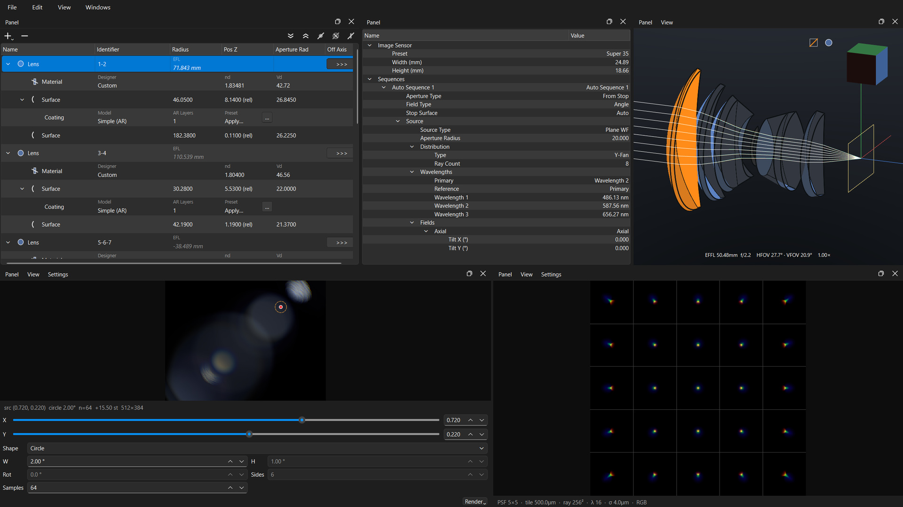
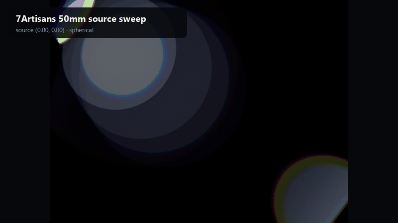
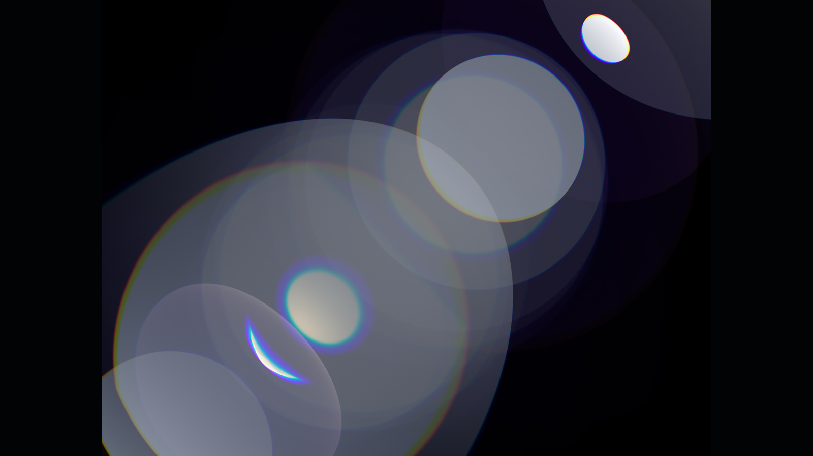
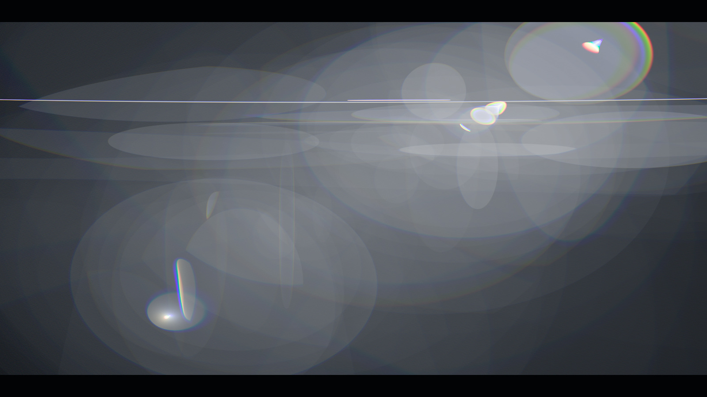
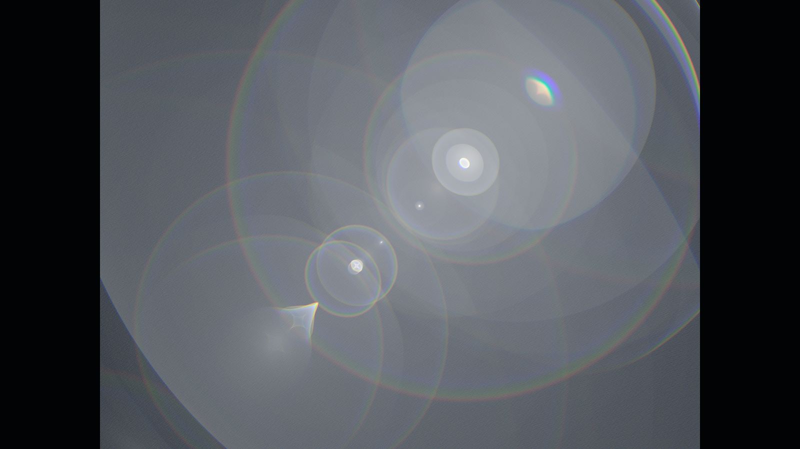
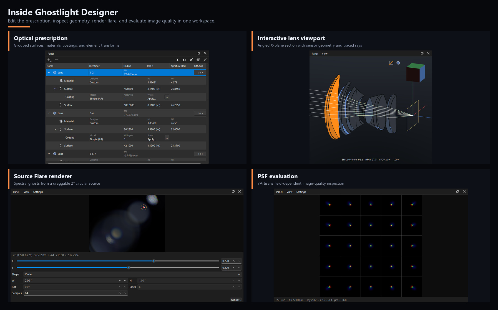
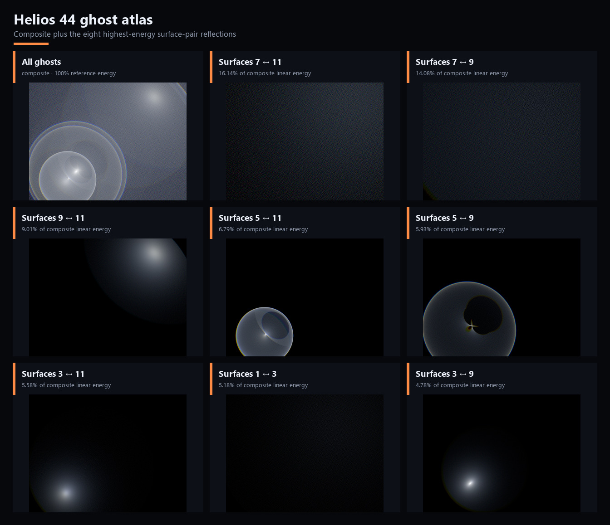
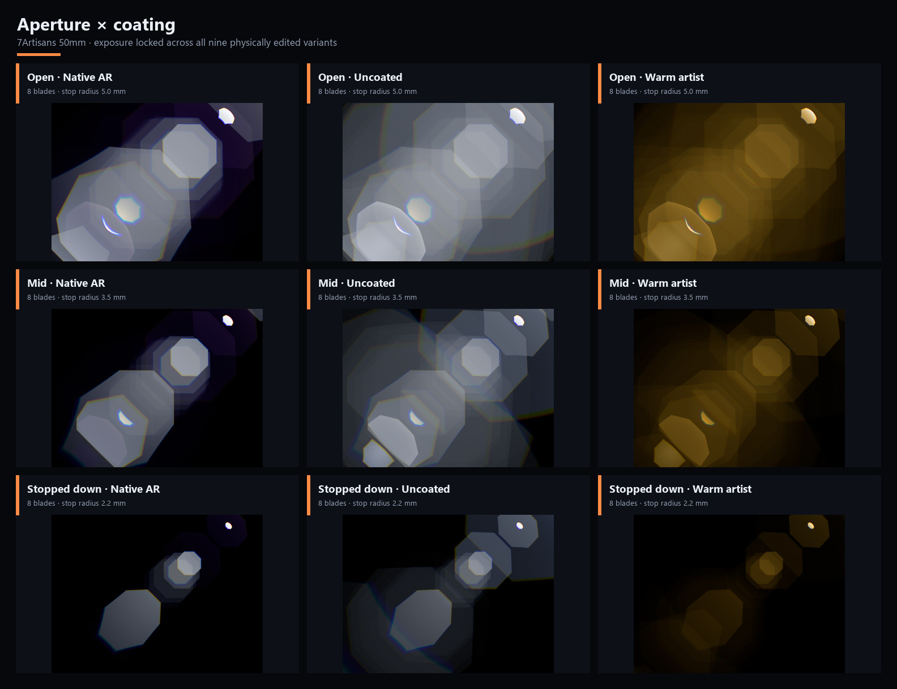
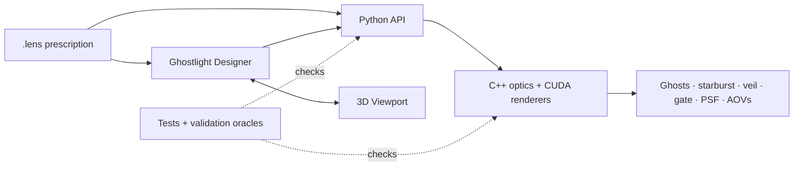

<h1 align="center">Ghostlight</h1>

<p align="center">
  <strong>Your lens is the flare.</strong><br>
  <sub>Design optical systems and render spectral flares directly from their geometry, glass, coatings, and aperture.</sub>
</p>

<p align="center">
  <a href="#getting-started"></a>
  <a href="#requirements"></a>
  <a href="LICENSE"></a>
  
</p>

Ghostlight is an open-source optical-design and rendering system. It follows
light through a lens prescription - its curvature, glass, coatings, aperture,
alignment, and internal reflections - to produce the flare behavior of that
optical system instead of assembling a look from painted elements or sprites.

The project is more than a rendering core. It includes a desktop lens-design
workstation, an interactive 3D viewport, CUDA renderers, Python bindings, a
portable lens format and library, and a validation suite for the physics that
connects them.

> Ghostlight is under active development. Interfaces, file-format details, and
> installation steps may still change before the first stable release.

## Render examples

### Designer workspace

<p align="center">
  <br>
  <strong>Design, inspect, and render in one workspace</strong><br>
  <sub>Optical editor, interactive viewport, flare rendering, and lens evaluation</sub>
</p>

### In motion

<table>
  <tr>
    <td width="50%" align="center">
      <a href=".github/media/source-sweep.mp4"></a><br>
      <strong>Atlas 40 mm source sweep</strong><br>
      <sub>Ghost motion from on-axis through the chosen diagonal frame</sub>
    </td>
    <td width="50%" align="center">
      <a href=".github/media/spherical-source-sweep.mp4"></a><br>
      <strong>7Artisans 50 mm source sweep</strong><br>
      <sub>Spherical ghost motion along the same source path</sub>
    </td>
  </tr>
  <tr>
    <td width="50%" align="center">
      <a href=".github/media/element-pivot.mp4"></a><br>
      <strong>Canon 24 mm element pivot rig</strong><br>
      <sub>One Pivot control translating a grouped optical section</sub>
    </td>
    <td width="50%" align="center">
      <a href=".github/media/decenter-strength.mp4"></a><br>
      <strong>Canon 24 mm progressive decenter</strong><br>
      <sub>Seeded element offsets from nominal to distressed</sub>
    </td>
  </tr>
</table>

<p align="center"><sub>Click an animation for its full-quality H.264 version.</sub></p>

### Finished stills

<table>
  <tr>
    <td width="33.33%" align="center">
      <br>
      <strong>7Artisans 50 mm</strong><br>
      <sub>Spherical hero at the diagonal source position</sub>
    </td>
    <td width="33.33%" align="center">
      <br>
      <strong>Atlas 40 mm F3.5 1.5x</strong><br>
      <sub>Published anamorphic hero, displayed desqueezed</sub>
    </td>
    <td width="33.33%" align="center">
      <br>
      <strong>Canon EF 24 mm</strong><br>
      <sub>Dense ghost structure from the Canon 24 mm prescription</sub>
    </td>
  </tr>
</table>

### Inside Designer

<p align="center">
  <br>
  <strong>One lens, several ways to understand it</strong><br>
  <sub>Optical editing, 3D inspection, flare exploration, PSF analysis, coatings, and optimization</sub>
</p>

### Comparisons and contact sheets

<table>
  <tr>
    <td colspan="2" align="center">
      <br>
      <strong>Helios 44 ghost atlas</strong><br>
      <sub>Individual surface-pair AOVs and their composite</sub>
    </td>
  </tr>
  <tr>
    <td colspan="2" align="center">
      <br>
      <strong>Aperture × coating matrix</strong><br>
      <sub>How physical lens choices alter flare shape, colour, and intensity</sub>
    </td>
  </tr>
</table>

## One optical system, several ways to work

| Part | What it does |
|---|---|
| **Ghostlight Designer** | A PySide6 desktop workstation for building and editing lenses, inspecting ghosts, rendering source flares and PSF grids, evaluating image quality, and optimizing a prescription. |
| **Ghostlight Viewport** | An interactive 3D view of elements, surfaces, stops, sensors, transforms, clipping, selections, and traced rays. It is embedded in Designer and is also a reusable Python package. |
| **Ghostlight Optics** | The C++/CUDA tracing and rendering engine, exposed through the `ghostlight` Python package. It handles calibration, ghost paths, spectral sampling, diffraction, and output AOVs. |
| **Ghostlight Optical** | A versioned JSON `.lens` format with stable UUIDs, rigid element transforms, pivots, glass dispersion, surface forms, coatings, and aperture definitions. |
| **Lens library** | A growing collection of spherical and anamorphic prescriptions, ranging from compact examples to real and research-derived designs. |
| **Validation** | Numerical oracles, golden images, schema checks, GPU tests, and focused regressions for tracing, diffraction, flare layers, culling, calibration, and viewport geometry. |

The layers share one physical model:



## What Ghostlight renders

- **Internal-reflection ghosts** from enumerated pairs of optical surfaces,
  including off-screen and extended light sources.
- **Spectral colour** using wavelength-dependent glass dispersion, coating
  response, CIE colour matching, and configurable input/output colour spaces.
- **Aperture diffraction** whose starburst follows the physical iris, including
  circular, polygonal, custom-image, and shaped-blade profiles.
- **Veiling glare and gate flare** as separate physical or look-defining passes,
  not baked into the ghost result.
- **Point-spread-function grids** for inspecting field-dependent image quality,
  focus, vignetting, and anamorphic behaviour.
- **Production-friendly layers**, including the composite and per-ghost AOVs,
  with scene-linear EXR animation export available in Designer.

Because these features all originate in the same prescription, editing a
surface, moving a group, changing the stop, or replacing a coating can affect
the viewport, optical evaluation, and final flare together.

## How it works

1. A `.lens` file describes an ordered optical system: elements, surface forms,
   glass dispersion, coatings, apertures, transforms, and optional control rigs.
2. Ghostlight calibrates the lens and traces rays through its physical surfaces.
   A ghost path transmits through the system except at a selected pair of
   surfaces, where the ray reflects and continues toward the sensor.
3. CUDA kernels integrate the surviving energy across the entrance pupil and
   visible spectrum, then generate the requested flare, diffraction, glare, or
   PSF layers.
4. Designer presents those results through an ACES-aware display pipeline while
   preserving scene-linear data for Python and EXR workflows.

This means ghost position, chromatic separation, vignetting, aperture shape,
surface alignment, and Fresnel intensity emerge from the lens rather than from
a sprite library.

## Ghostlight Designer

Designer is the main interactive entry point. Its dockable workspace includes:

- an optical design editor with spherical, aspherical, and cylindrical surfaces;
- material and coating catalogues, including measured and thin-film models;
- element transforms, muting, reordering, pivots, and anamorphic construction;
- the live 3D viewport and ray visualization;
- Source Flare, Ghost Explorer, and PSF Grid renderers;
- spot diagrams, field diagrams, and Seidel aberration views;
- multi-variable lens optimization with bounded design goals; and
- GIF, MOV, JPEG-sequence, and scene-linear EXR-sequence animation export.

Workspace layouts can be rearranged and saved, so the same application can act
as a compact flare look-development tool or a fuller optical workstation.

## Getting started

### Requirements

| Dependency | Minimum | Notes |
|---|---:|---|
| Python | 3.9 | Python 3.10–3.12 recommended |
| CMake | 3.18 | Required to build the native extension |
| CUDA Toolkit | 12.x | Tested on 13.2. **CUDA 11.x does not work** — see below. Requires a compatible NVIDIA driver |
| C++ compiler | MSVC 2019 / GCC 9 | Newer supported toolchains are recommended |
| NVIDIA GPU | Maxwell generation | A modern RTX GPU is recommended for interactive work |
| PySide6 | 6.4 | Installed automatically with Designer |

Ninja is optional, but usually makes local builds faster. MOV rendering also needs
an `ffmpeg` executable on `PATH`; the other export formats do not.

#### Choosing a CUDA toolkit

With more than one toolkit installed, the one CMake picks is often not the
`nvcc` first on your `PATH`.

On Windows the build normally runs through the Visual Studio generator, which
resolves CUDA through its MSBuild integration: it follows `CUDA_PATH` and
ignores both `CMAKE_CUDA_COMPILER` and `CUDACXX`. A machine whose `CUDA_PATH`
names one toolkit while `PATH` leads to another builds against the one
`CUDA_PATH` names, silently. Select a toolkit explicitly instead:

```powershell
.\build.ps1 -CudaToolkit "12.6" -Install
```

If that version is not installed, the build fails rather than quietly falling
back, but the message is indirect: MSBuild reports a missing
`...<version>.props` import (`MSB4019`) rather than naming the toolkit.

On Linux the Make and Ninja generators do honour the compiler, so the script
sets `CUDACXX` for you:

```bash
bash build.sh --cuda-toolkit /usr/local/cuda-12.6 --install
```

Both scripts print the toolkit and the final `CMAKE_ARGS` before building, and
both extend `CMAKE_ARGS` rather than replace it, so any CMake options you
export yourself are passed through.

The toolkit also caps the architectures you can target: Blackwell (`120`) needs
CUDA 12.8 or newer, and Hopper (`90`) needs 11.8 or newer.

#### Known-good CUDA versions

This table records what has actually been exercised, not what is expected to
work:

| Toolkit | Status |
|---|---|
| 13.2 | **Tested.** Full test suite and the `validation/` golden gate pass. |
| 12.x | Untested. |
| 11.8 | **Known broken.** Compiles, but see below. |

An 11.8 build fails two ways. `cudaCreateTextureObject` is rejected with
`invalid argument` when uploading image-aperture textures, so any lens using an
`APERTURE_IMAGE` stop errors at render time. Separately, its numerical output
diverges from the committed goldens by far more than the usual atomic-ordering
noise — up to roughly 1900 ppm, where the normal floor is under 1 ppm — and
even the starburst passes, which contain no atomics and are otherwise
bit-exact, shift. The goldens under `validation/goldens/` are therefore tied to
the toolkit that produced them; regenerating them on a different major CUDA
version is expected to move them.

### Windows

From a PowerShell prompt:

```powershell
git clone https://github.com/JaydenB/ghostlight.git
cd ghostlight

# Build and install the native renderer + Python API.
cd ghostlight\bindings\python
.\build.ps1 -Install
cd ..\..\..

# Install the viewport and desktop application.
python -m pip install .\ghostlight_viewport
python -m pip install .\ghostlight_designer

ghostlight-designer
```

To target only the GPU in your workstation and shorten compilation, pass its
CUDA compute capability—for example `-CudaArchitectures "89"` for an RTX 4090.

The default architecture list covers Maxwell through Hopper (`50`–`90`).
Blackwell (`120`) is not included because it needs CUDA 12.8 or newer; on a
recent toolkit add it with `-CudaArchitectures "120"`.

### Linux

```bash
git clone https://github.com/JaydenB/ghostlight.git
cd ghostlight

cd ghostlight/bindings/python
bash build.sh --install
cd ../../..

python -m pip install ./ghostlight_viewport
python -m pip install ./ghostlight_designer

ghostlight-designer
```

Desktop support is currently developed primarily on Windows. The optics package
and build scripts also support Linux; platform-specific UI behaviour may vary.

### Developer build on Windows

For a fast edit/build/test loop, install `pybind11`, then run the root helper:

```powershell
python -m pip install pybind11
.\build_dev.ps1 -CudaArchitectures "89"
```

It builds `_ghostlight`, copies the extension into the Python source package,
and performs an import smoke test.

For an editable install (`python -m pip install -e .\ghostlight_designer`),
run `ghostlight-designer` and `pytest` from a directory other than the
repository root. The root holds folders named `ghostlight`,
`ghostlight_viewport`, and `ghostlight_designer`, and Python resolves those
ahead of an editable install, importing them as empty namespace packages.
The non-editable install used above is unaffected.

## Python quick start

The distribution is named `ghostlight-optics`; the import is simply
`ghostlight`.

```python
import ghostlight

system = ghostlight.OpticalSystem.load(
    "lenses/DoubleGauss.lens"
)

config = ghostlight.PointFlareConfig()
config.source_x = 0.72
config.source_y = 0.48
config.ray_grid = 64
config.spectral_samples = 16
config.flare_gain = 800.0

result = system.render_point_flare(1920, 1080, config)

# Each channel is a scene-linear float32 NumPy array.
ghost_rgb = ghostlight._arrays.ghost_to_hwc(result)
print(ghost_rgb.shape, ghost_rgb.dtype, ghost_rgb.max())
```

Ghost values are scene-linear and unexposed, so that maximum is typically a
small fraction of 1.0 — the render is correct even though it looks black if you
write it straight to an 8-bit image. Apply an exposure and a view transform
before display; Designer's render panels use the ACES 2.0 view transform.

Extended sources use weighted angular samples:

```python
offsets = ghostlight.source_sampling.sample_disk(0.004, n=64)
result = system.render_source_flare(offsets, 1920, 1080, config)
```

For lower-level diagnostics, the same package exposes individual surfaces,
rays, trace events, calibration, ghost-pair enumeration, filtering, and CPU
diagnostic paths.

## Lens files

Ghostlight Optical files are UTF-8 JSON documents with a `.lens` extension. A
file is self-contained: it can carry its glass data, optical elements, surface
geometry, coating and aperture modifiers, stable IDs, and a pivot rig for moving
groups of elements.

The repository ships fifteen prescriptions and studies — spherical primes,
anamorphic systems built on cylindrical surfaces, and a pair of experimental
designs. See the [lens-format and library guide](lenses/README.md) for the
schema, coordinate conventions, worked examples, and Python round-trip API.

## Testing and validation

The suites need `pytest`, plus `PyYAML` for one designer test. Each package
declares its test dependencies under a `dev` extra:

```powershell
python -m pip install ".\ghostlight\bindings\python[dev]" `
    ".\ghostlight_viewport[dev]" ".\ghostlight_designer[dev]"
```

The extras also pull in `matplotlib`, which the `validation/` scripts import.

Run the Python suites from the repository root:

```powershell
python -m pytest ghostlight/bindings/python/tests -v
python -m pytest ghostlight_viewport/tests -v
python -m pytest ghostlight_designer/tests -v
```

GPU tests are marked separately:

```powershell
python -m pytest ghostlight/bindings/python/tests -m "not gpu"
python -m pytest ghostlight/bindings/python/tests -m gpu
```

The `validation/` directory contains targeted numerical and golden-reference
checks for render behaviour that is difficult to express as a small unit test.
For example:

```powershell
python validation\aperture_baseline.py
```

## Repository map

```text
ghostlight/              C++/CUDA engine, Python bindings
ghostlight_designer/     Desktop optical-design and flare-rendering application
ghostlight_viewport/     Reusable PySide6/OpenGL lens viewport
lenses/                  Lens schema, tools, and prescription collection
validation/              Numerical oracles, golden references, and render gates
build_dev.ps1            Fast Windows native-development build
```

A Nuke integration is **not implemented yet** and is not part
of the current build.

## Lineage

Ghostlight grew out of **Flaresim**, Eamonn Nugent’s original CPU lens-flare
renderer and optical tracing work, now preserved at
[`space55/blackhole-rt`](https://github.com/space55/blackhole-rt). That project
established the ray-tracing approach, optical physics, and early lens data that
made this work possible.

The immediate ancestor of this repository was Steve Watts Kennedy’s
Nuke-oriented fork,
[`LocalStarlight/flaresim_nuke`](https://github.com/LocalStarlight/flaresim_nuke).

Ghostlight has since expanded into its own renderer, file format, and
design application, but that lineage remains foundational and is credited in
the license.

## License

Ghostlight is available under the [MIT License](LICENSE). Copyright is retained
by the contributors named there.
